# Brain Tumor CDSS - OOAD Documentation Package

## 1. Repository Understanding Summary
The **BrainTumor_CDSS** is an advanced AI-assisted academic prototype designed for Brain MRI tumor analysis. It acts as an end-to-end Clinical Decision Support System (CDSS) providing MRI upload, preprocessing, tumor detection, segmentation, multi-class classification, and research-grade stage estimation. A distinguishing feature of the system is its strong emphasis on clinical safety, explainable AI (Grad-CAM overlays), longitudinal scan tracking (tumor progression index), and a RAG-grounded patient history retrieval mechanism. The architecture follows a layered approach: a Flask/Jinja frontend (with a Next.js legacy option), a FastAPI backend serving REST APIs, an ML inference layer leveraging PyTorch/MONAI, and a persistent layer using SQLAlchemy with SQLite/PostgreSQL alongside ChromaDB/TF-IDF for vector search. Safety disclaimers and human-in-the-loop (corrected mask uploads) are strictly maintained throughout the platform.

---

## 2. Diagram Index

| Diagram Name | UML/OOAD Type | Purpose | Main Actors/Modules |
|---|---|---|---|
| A.1 Overall System | Use Case | High-level overview of system capabilities | Patient, Doctor, Admin, AI Engine, Report Generator, RAG, Database |
| A.2 Doctor Workflow | Use Case | Detail the clinical interaction with the system | Doctor/Radiologist |
| A.3 Admin Workflow | Use Case | Detail the research, metric, and dashboard interactions | Admin/Researcher |
| A.4 Patient History & RAG | Use Case | Detail the vector search and summarization workflow | Doctor, RAG Service, DB |
| B.1 Domain Model | Class Diagram | Conceptual entities and their relationships | Patient, Scan, Results, Report, RagDocument |
| B.2 Backend Services | Class Diagram | Service layer architecture in FastAPI | InferenceService, ReportService, PatientService, etc. |
| B.3 ML Pipeline | Class Diagram | AI model training and inference structures | Preprocessor, ClassifierModel, SegmentationModel, GradCAMGenerator |
| B.4 Report Generation | Class Diagram | PDF construction components | ReportService, PDFBuilder, ReportSection |
| B.5 RAG / Vector Search | Class Diagram | Retrieval-Augmented Generation implementation | RAGQueryService, RagDocument, VectorIndex |
| C.1 Sample Patient Flow | Object Diagram | Instance-level view of a single clinical encounter | DEMO001, Scan1, Scan2, Comparison, Report |
| D.1 MRI Full AI Analysis | Sequence Diagram | Step-by-step API call for scan inference | User, API, Preprocessing, ML Engines, DB |
| D.2 Patient Auto-ID | Sequence Diagram | Auto-generation and matching of patient records | User, API, PatientService, DB |
| D.3 Segmentation & XAI | Sequence Diagram | Mask generation and Grad-CAM consistency | Image, SegmentationEngine, ExplainabilityEngine |
| D.4 Longitudinal Comparison | Sequence Diagram | Tracking tumor growth between scans | Doctor, API, ComparisonService, DB |
| D.5 PDF Report Generation | Sequence Diagram | Building the hospital-style report | Doctor, ReportService, PDFBuilder, Storage |
| D.6 RAG Query Flow | Sequence Diagram | Grounded search against patient history | Doctor, RAGService, VectorDB |
| D.7 Corrected Mask (HITL) | Sequence Diagram | Active learning and radiologist correction | Radiologist, API, Storage |
| D.8 Dashboard Summary | Sequence Diagram | Fetching analytics and metrics | Admin, DashboardService, DB |
| E.1 End-to-End MRI Activity | Activity Diagram | Flowchart of the primary clinical path | Preprocess -> Detect -> Segment -> Classify -> Report |
| E.2 Patient Matching | Activity Diagram | Logic for deduplication and patient ID assignment | ID Validation, Similarity Search |
| E.3 Longitudinal Comparison | Activity Diagram | Logic for area/volume delta calculations | Select Scans -> Compute Delta -> Determine Status |
| E.4 RAG Query Activity | Activity Diagram | Query embedding and fallback logic | Vector Search, TF-IDF Fallback |
| E.5 Corrected Mask Activity | Activity Diagram | Validation and linkage of radiologist feedback | Validate Mask -> Store -> Mark for AL |
| F.1 Scan Lifecycle | State Diagram | Status transitions of an MRI upload | Uploaded, Validated, Analyzed, Archived |
| F.2 Patient Record Lifecycle | State Diagram | State of patient profile aggregation | Created, Scans Added, RAG Indexed |
| F.3 Report Lifecycle | State Diagram | PDF generation status | Requested, Building, Stored, Failed |
| F.4 RAG Document Lifecycle | State Diagram | Indexing and updating states | Created, Indexed, Cited, Updated |
| G.1 System Components | Component Diagram | High-level physical/logical boundaries | Flask UI, FastAPI, DB, Storage, ML Models |
| H.1 Project Packages | Package Diagram | Directory and namespace organization | backend, ml, frontend, data, docs |
| I.1 Demo Deployment | Deployment Diagram | Localhost viva-ready architecture | Browser, Flask, FastAPI, SQLite |
| I.2 Prod Deployment | Deployment Diagram | Scalable cloud architecture | Reverse Proxy, API Container, GPU Worker, S3 |
| J.1 Database ERD | ER Diagram | Relational schema modeling | patients, scans, scan_probabilities, comparisons |
| K.1 System Context (L0) | DFD Level 0 | External interactions with the system | User, CDSS, Models, Storage |
| K.2 Data Processing (L1) | DFD Level 1 | Internal data transformations | Processes 1.0 (Upload) to 7.0 (Report) |
| L.1 Analysis Collaboration | Communication | Object message passing during analysis | Controllers, Services, DB |
| M.1 API Interfaces | Interface Diagram | RESTful endpoints and consumers | Routes: /scans, /patients, /reports, /rag |
| N.1 Architecture Layers | Architecture View | Tiered separation of concerns | Presentation, API, Business, ML, Persistence |
| O.1 Security & Safety | Security Diagram | Clinical safeguards and disclaimers | Disclaimer Validation, Low Confidence Alert |

---

## A. Use Case Diagrams

### 1. Overall System Use Case Diagram
**Purpose:** Illustrate the primary actors and their high-level interactions with the CDSS.
**Explanation:** Shows the division of responsibilities. Patients/Users upload scans, Doctors analyze and query, Admins monitor metrics, and background engines perform processing.
**Assumptions:** 'Patient/User' refers to a clinical tech or the patient themselves accessing the portal. 'AI Analysis Engine' is treated as an autonomous actor responding to triggers.

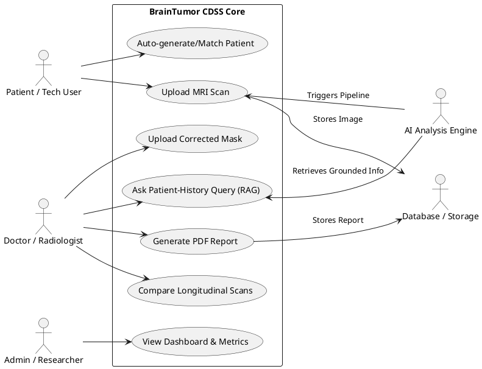

### 2. Doctor/Radiologist Workflow
**Purpose:** Details the specific actions a medical professional takes within the platform.
**Explanation:** Doctors can review scans, trigger reports, use the RAG system to interrogate patient histories, and provide corrected segmentations for active learning.

```mermaid
usecaseDiagram
    actor Doctor
    usecase "View Scan Results" as VS
    usecase "Download PDF Report" as DR
    usecase "Compare Current & Prev Scans" as CS
    usecase "Query RAG Patient History" as RAG
    usecase "Upload Corrected Mask" as UCM
    
    Doctor --> VS
    Doctor --> DR
    Doctor --> CS
    Doctor --> RAG
    Doctor --> UCM
    VS ..> DR : <<includes>>
```

### 3. Admin/Researcher Workflow
**Purpose:** Illustrates backend management and model evaluation tasks.
**Explanation:** Admins look at aggregate data, assess model leaderboards, and check overall system health.

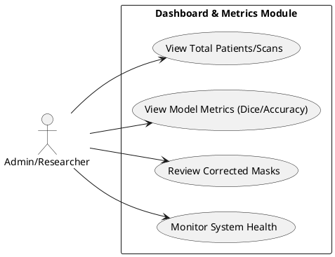

### 4. Patient History & RAG Workflow
**Purpose:** Showcases the interaction with the Retrieval-Augmented Generation subsystem.
**Explanation:** The doctor enters a query, the system generates embeddings, retrieves vectors, and produces a grounded response.

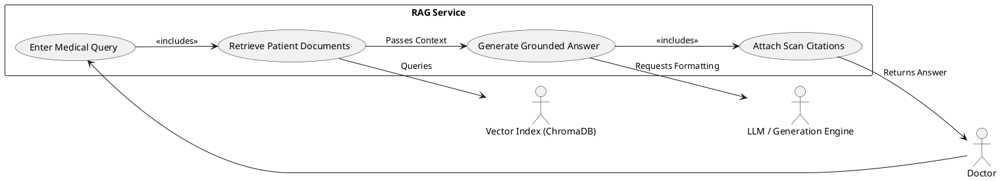

---

## B. Class Diagrams

### 1. Domain Model Class Diagram
**Purpose:** Represents the core clinical and analytical entities and their relational mappings.
**Explanation:** Shows `Patient` having multiple `Scan`s. `Scan`s have associations with various results (Segmentation, Classification). `Comparison` links two `Scan`s.
**Assumptions:** Although unified in a single `Scan` DB table in the actual code, domain modeling separates the conceptual concerns (SegmentationResult, ClassificationResult) for clarity.

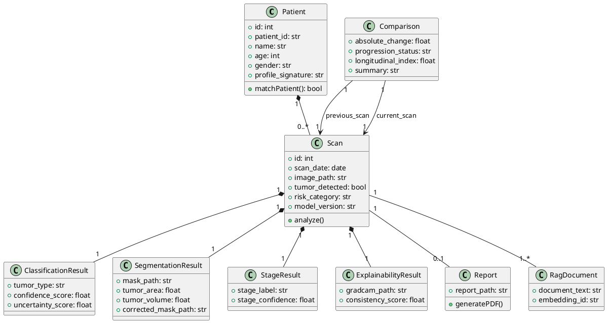

### 2. Backend Service Class Diagram
**Purpose:** Details the FastAPI backend service layer.
**Explanation:** Represents the separation of concerns across different Python service files (e.g., `inference_service.py`, `report_service.py`).
**Assumptions:** Models actual `backend/services` module structure.

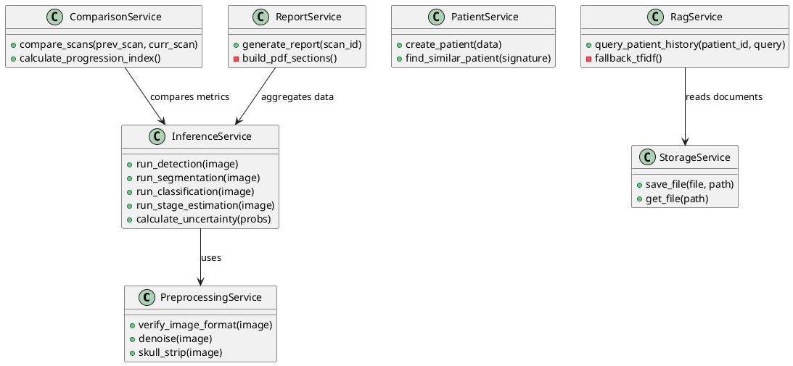

### 3. ML Pipeline Class Diagram
**Purpose:** Shows the architectural design of the PyTorch/MONAI ML pipelines.
**Explanation:** Delineates Dataset loading, Model architectures, and Evaluators.

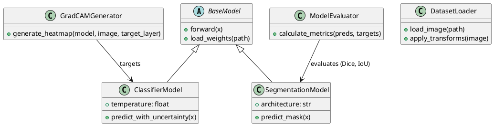

### 4. Report Generation Class Diagram
**Purpose:** Details the object structure responsible for generating the PDF report.
**Explanation:** Follows the Builder pattern conceptually, assembling various sections of the hospital-style report.

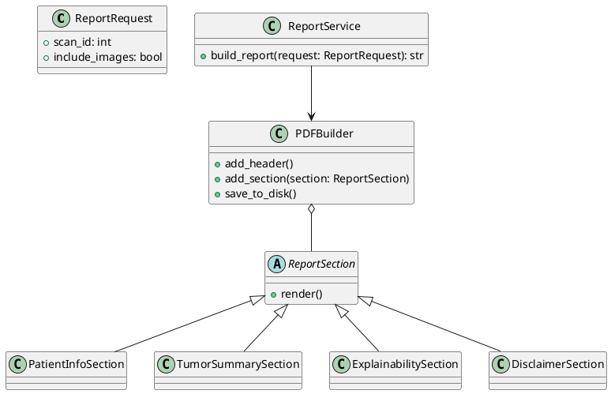

### 5. RAG/Vector Search Class Diagram
**Purpose:** Details the RAG (Retrieval-Augmented Generation) subsystem.
**Explanation:** Shows the interaction between the RAG API, the VectorDB adapter (ChromaDB), and the fallback mechanism (TF-IDF).

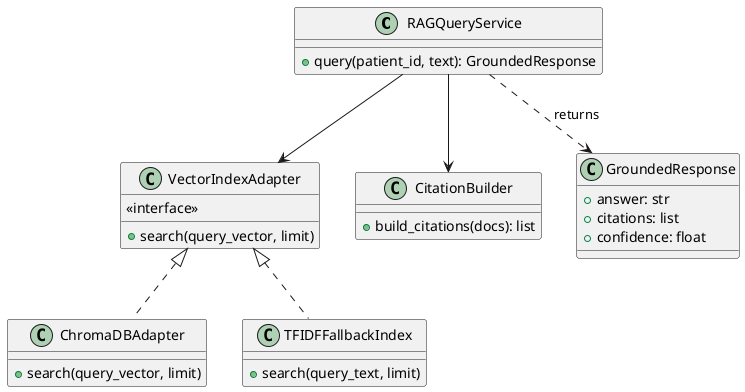

---

## C. Object Diagram

### 1. Sample Patient Flow Object Diagram
**Purpose:** Shows a concrete runtime snapshot of objects for a patient named DEMO001 undergoing longitudinal comparison.

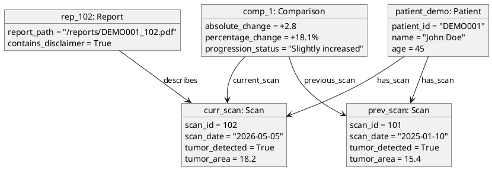

---

## D. Sequence Diagrams

### 1. MRI Upload and Full AI Analysis Flow
**Purpose:** Illustrates the complex pipeline triggered when a single MRI is uploaded.

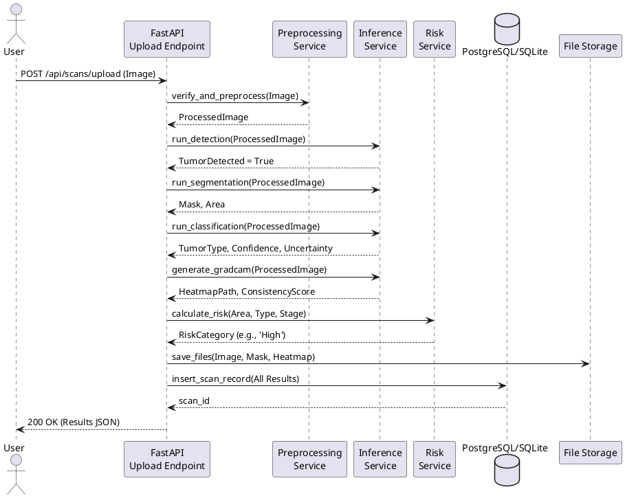

### 2. Patient Auto-ID and Similarity Matching Flow
**Purpose:** Shows how the system handles uploads without explicit patient IDs by generating signatures.

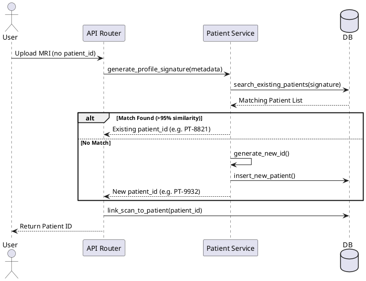

### 3. Tumor Segmentation and Explainability Flow
**Purpose:** Details the specific interaction between generating a mask and validating it via Grad-CAM.

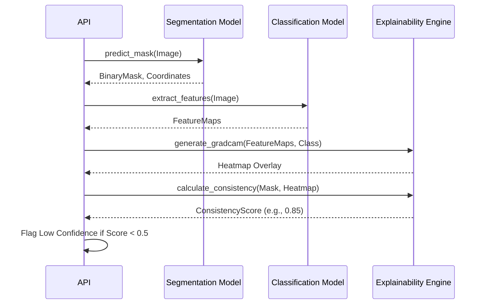

### 4. Longitudinal Scan Comparison Flow
**Purpose:** Illustrates how doctors compare progression between two dates.

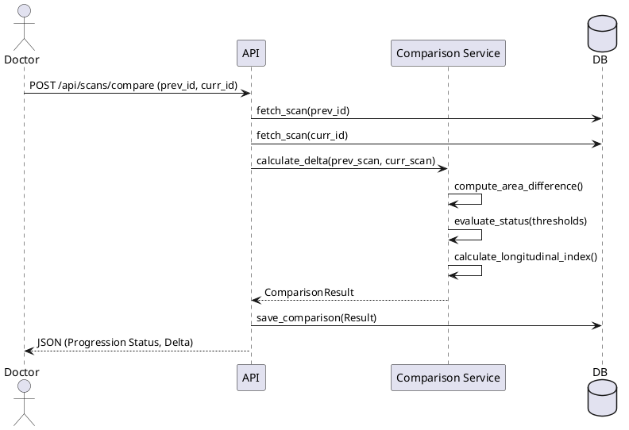

### 5. PDF Report Generation Flow
**Purpose:** Traces the assembly of the final professional medical report.

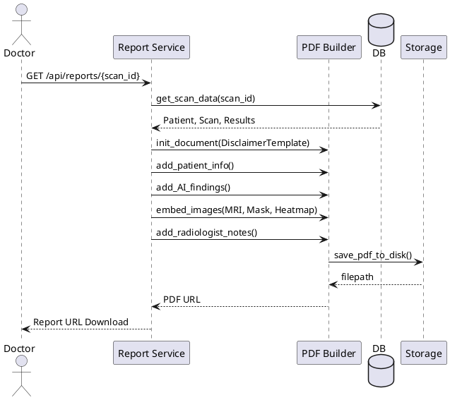

### 6. RAG Patient History Query Flow
**Purpose:** Shows the query path for grounded conversational retrieval.

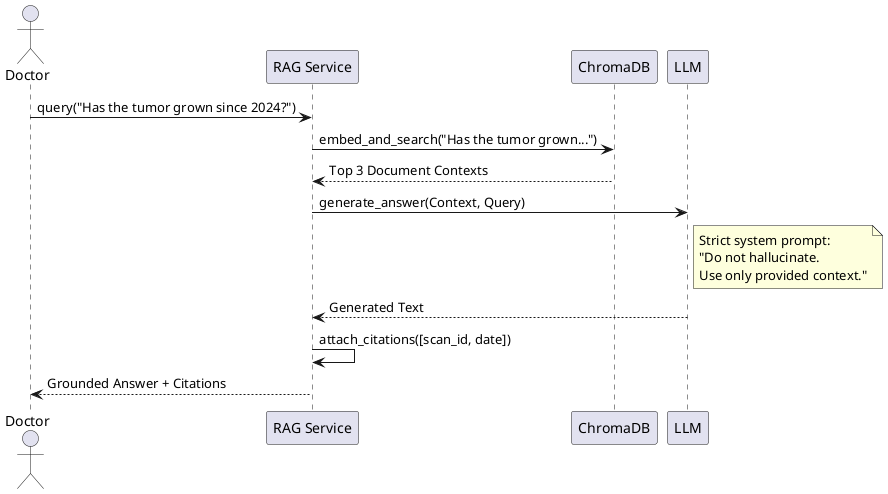

### 7. Corrected Mask Human-in-the-Loop Flow
**Purpose:** Demonstrates the active learning feedback mechanism.

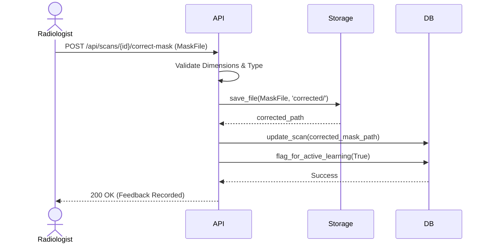

### 8. Dashboard Summary Flow
**Purpose:** Admin data aggregation flow.

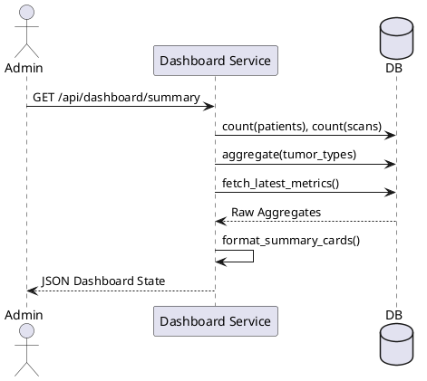

---

## E. Activity Diagrams

### 1. End-to-End MRI Analysis Activity
**Purpose:** High-level operational flowchart of the platform's primary feature.

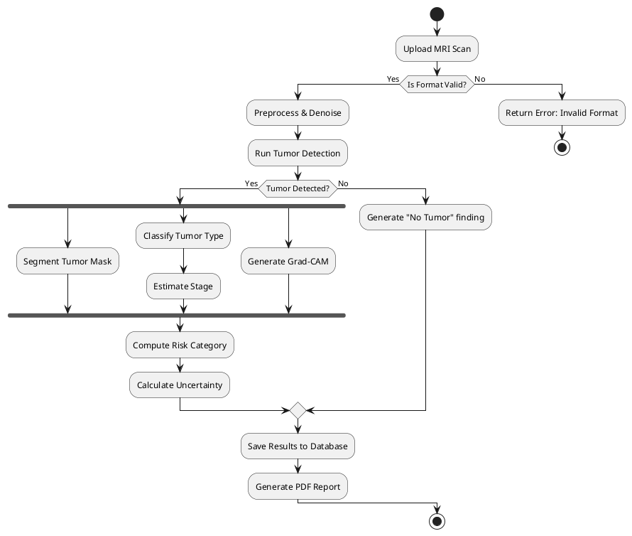

### 2. Patient Matching Activity
**Purpose:** Flowchart for deduplication logic.

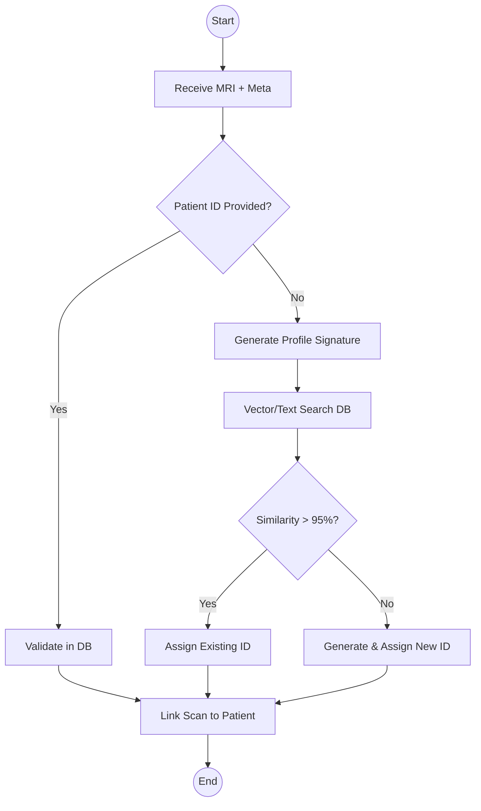

### 3. Longitudinal Comparison Activity
**Purpose:** Logic for comparing two scans to determine progression.

```plantuml
@startuml
start
:Select Patient;
:Fetch Scans List;
if (Scan Count >= 2) then (Yes)
  :Select Previous & Current Scan;
  :Compare Tumor Area/Volume;
  :Compare Tumor Types;
  if (Current Volume > Previous + Threshold) then (Yes)
    :Status = "Increased";
  else if (Current Volume < Previous - Threshold) then (Yes)
    :Status = "Improved";
  else
    :Status = "Stable";
  endif
  :Calculate Progression Index;
  :Save Comparison Result;
else (No)
  :Alert: "Insufficient scans for comparison";
endif
stop
@enduml
```

### 4. RAG Query Activity
**Purpose:** Fallback logic for vector searches.

```plantuml
@startuml
start
:Receive Query;
:Embed Query Text;
:Search Vector Index (ChromaDB);
if (Results Sufficient?) then (Yes)
  :Use ChromaDB Results;
else (No)
  :Search TF-IDF Fallback Index;
  :Use TF-IDF Results;
endif
:Format Context;
:Prompt LLM with Medical Guardrails;
:Extract Citations;
:Return Response;
stop
@enduml
```

### 5. Corrected Mask Upload Activity
**Purpose:** Validation of human-in-the-loop inputs.

```mermaid
flowchart TD
    Start((Start)) --> Upload[Upload Mask File]
    Upload --> ValDims[Validate Dimensions Match MRI]
    ValDims --> ValBin[Validate Binary/Grayscale Format]
    ValBin --> Save[Save to Corrected Directory]
    Save --> UpdateDB[Update DB Record]
    UpdateDB --> Flag[Mark for Active Learning]
    Flag --> End((End))
```

---

## F. State Machine Diagrams

### 1. Scan Lifecycle
**Purpose:** Tracks the lifecycle of a single MRI file within the CDSS.

```plantuml
@startuml
[*] --> Uploaded
Uploaded --> Validated : Format Check Pass
Uploaded --> Error : Format Check Fail
Validated --> Preprocessed
Preprocessed --> Analyzed : AI Inference Complete
Analyzed --> ResultsStored
ResultsStored --> ReportGenerated : PDF Created
ResultsStored --> LowConfidenceReview : Uncertainty > Threshold
LowConfidenceReview --> CorrectedMaskSubmitted : Radiologist Edits
CorrectedMaskSubmitted --> Archived
ReportGenerated --> Archived
Archived --> [*]
@enduml
```

### 2. Patient Record Lifecycle
**Purpose:** Status of a patient profile over time.

```plantuml
@startuml
[*] --> Created : New ID Assigned
Created --> Active : Scans Added
Active --> HistoryUpdated : Scans Processed
HistoryUpdated --> ComparedLongitudinally : Multiple Scans Present
HistoryUpdated --> RAGIndexed : Summaries Embedded
RAGIndexed --> Active : New Scan Added
@enduml
```

### 3. Report Lifecycle
**Purpose:** Status of PDF generation.

```mermaid
stateDiagram-v2
    [*] --> Requested
    Requested --> DataFetched
    DataFetched --> PDFBuilding
    PDFBuilding --> Stored: Success
    PDFBuilding --> Failed: Error
    Failed --> Requested: Retry
    Stored --> Downloadable
    Downloadable --> [*]
```

### 4. RAG Document Lifecycle
**Purpose:** Represents how clinical texts are managed for search.

```plantuml
@startuml
[*] --> Created : Summary Generated
Created --> Indexed : Added to Vector DB
Indexed --> Retrieved : Matched in Search
Retrieved --> Cited : Used in LLM Response
Cited --> Indexed
Indexed --> Updated : Mask Corrected / Reprocessed
Updated --> Indexed
@enduml
```

---

## G. Component Diagram

### 1. System Components
**Purpose:** Illustrates the high-level physical and logical boundaries of the application.
**Explanation:** Shows the UI layer talking to the FastAPI backend, which relies on DB, Storage, and ML Inference modules.

```plantuml
@startuml
package "Presentation Layer" {
  [Flask/Jinja UI] as UI
  [Next.js UI (Legacy)] as NextUI
}

package "Backend Services (FastAPI)" {
  [API Router] as Router
  [Business Logic Services] as Biz
  [Report Generator] as RepGen
  [RAG Service] as RAG
}

package "Machine Learning Layer" {
  [Preprocessing Module] as Preproc
  [Classification Model (ResNeXt101)] as Classifier
  [Segmentation Model (UNet)] as Segmenter
  [Explainability Module] as XAI
}

package "Data Layer" {
  database "PostgreSQL/SQLite" as RDBMS
  database "ChromaDB (Vector)" as VDB
  folder "Local File Storage" as FileStore
}

UI --> Router : HTTP/REST
NextUI --> Router : HTTP/REST
Router --> Biz
Biz --> RepGen
Biz --> RAG
Biz --> Preproc
Biz --> Classifier
Biz --> Segmenter
Biz --> XAI

Biz --> RDBMS : SQLAlchemy ORM
RAG --> VDB : Embeddings
RepGen --> FileStore : Save PDFs
Preproc --> FileStore : Load MRIs
@enduml
```

---

## H. Package Diagram

### 1. Project Packages
**Purpose:** Maps directly to the GitHub repository directory structure.
**Explanation:** Shows `backend`, `ml`, `frontend`, etc., and their inner structure.

```plantuml
@startuml
package "BrainTumor_CDSS" {
  package "frontend" {
    [Templates]
    [Static (CSS/JS)]
  }
  
  package "backend" {
    package "api.routes" {}
    package "services" {}
    package "models" {}
    package "database" {}
    package "utils" {}
  }
  
  package "ml" {
    package "preprocessing" {}
    package "classification" {}
    package "segmentation" {}
    package "explainability" {}
    package "evaluation" {}
  }
  
  package "data" {
    [raw]
    [processed]
    [masks]
  }
  
  package "docs" {}
  package "reports" {}
}

backend.api.routes --> backend.services
backend.services --> backend.models
backend.services --> ml.classification
backend.services --> ml.segmentation
ml --> data : reads/writes
@enduml
```

---

## I. Deployment Diagram

### 1. Local/Demo Deployment
**Purpose:** How the system runs for a viva presentation or local research workstation.
**Explanation:** Everything runs on `localhost` across different ports.

```plantuml
@startuml
node "User Workstation" {
  node "Browser" {
    [Web Dashboard]
  }
  
  node "Local Server" {
    component "Flask UI Server\n(localhost:3000)" as Flask
    component "FastAPI Backend\n(localhost:8000)" as FastAPI
    
    component "Python ML Runtime" as MLRuntime
    database "SQLite Database\n(backend.db)" as SQLite
    folder "Local Filesystem\n(/data, /reports)" as LocalStore
  }
}

[Web Dashboard] --> Flask : HTTP
[Web Dashboard] --> FastAPI : AJAX/REST
FastAPI --> MLRuntime : Direct Invocation
FastAPI --> SQLite : SQLAlchemy
FastAPI --> LocalStore : I/O
@enduml
```

### 2. Production-Ready Deployment
**Purpose:** How the system would be deployed in a scalable cloud/hospital IT environment.

```mermaid
graph TD
    Client[Client Browser] -->|HTTPS| Proxy[Nginx / Reverse Proxy]
    Proxy --> Frontend[Frontend Container]
    Proxy --> Backend[Backend API Container]
    
    Backend --> MLWorker[ML Inference Celery Worker]
    MLWorker --> GPU[GPU / CUDA Runtime]
    
    Backend --> PG[(PostgreSQL)]
    Backend --> S3[(Object Storage / S3)]
    Backend --> Chroma[(ChromaDB Vector Store)]
    
    MLWorker --> S3
```

---

## J. ER Diagram

### 1. Database Entity-Relationship Diagram
**Purpose:** Maps the relational database schema implemented in `entities.py`.
**Explanation:** Shows one-to-many relationships between Patients and Scans, and Scans to various sub-tables.
**Assumptions:** `Scan` table acts as a wide table containing segmentation, stage, and explainability results to minimize joins, representing a denormalized read-heavy design.

```plantuml
@startuml
entity "patients" as pat {
  * id : Integer <<PK>>
  --
  * patient_id : String(64) <<U>>
  * name : String(128)
  * age : Integer
  * gender : String(32)
  profile_signature : String(512)
}

entity "scans" as scn {
  * id : Integer <<PK>>
  * patient_db_id : Integer <<FK>>
  --
  * scan_date : Date
  * image_path : String(512)
  mask_path : String(512)
  tumor_detected : Boolean
  tumor_type : String(64)
  confidence_score : Float
  tumor_area : Float
  risk_category : String(32)
  model_version : String(64)
  radiologist_notes : Text
  corrected_mask_path : String(512)
}

entity "scan_probabilities" as prob {
  * id : Integer <<PK>>
  * scan_id : Integer <<FK>>
  --
  * class_name : String(64)
  * probability : Float
}

entity "comparisons" as comp {
  * id : Integer <<PK>>
  * patient_db_id : Integer <<FK>>
  * previous_scan_id : Integer <<FK>>
  * current_scan_id : Integer <<FK>>
  --
  * absolute_change : Float
  * progression_status : String(64)
  * summary : Text
}

entity "rag_documents" as rag {
  * id : Integer <<PK>>
  * patient_db_id : Integer <<FK>>
  * scan_id : Integer <<FK>>
  --
  * document_text : Text
  * embedding_id : String(128)
}

pat ||--o{ scn : "has"
scn ||--o{ prob : "has class confidences"
pat ||--o{ comp : "has"
scn ||--o{ comp : "referenced in (prev/curr)"
pat ||--o{ rag : "owns"
scn ||--o{ rag : "generates"
@enduml
```

---

## K. Data Flow Diagram

### 1. DFD Level 0 (System Context Diagram)
**Purpose:** High-level interactions with external entities.

```plantuml
@startuml
!pragma layout smetana
skinparam defaultTextAlignment center

circle "Patient /\nDoctor" as User
rectangle "Brain Tumor\nCDSS" as System
database "Data Storage\n(DB + Files)" as DB

User --> System : Upload MRI,\nPatient Info,\nQueries
System --> User : Reports,\nDashboards,\nAI Predictions
System <--> DB : Store/Retrieve Data
@enduml
```

### 2. DFD Level 1
**Purpose:** Internal breakdown of data processing nodes.

```mermaid
flowchart LR
    User([Doctor/User]) -->|MRI + Meta| P1(1.0 Upload & Validate)
    P1 -->|Raw Image| P2(2.0 Preprocess)
    P2 -->|Clean Image| P3(3.0 ML Inference)
    P3 -->|Segment/Classify Data| P4(4.0 Risk & Compare)
    P4 -->|Combined Results| P5(5.0 Persistence)
    P5 -->|Saved Data| DB[(Database & Storage)]
    DB -->|Fetch Data| P6(6.0 Report Gen)
    DB -->|Fetch Text| P7(7.0 RAG Query)
    P6 -->|PDF| User
    P7 -->|Grounded Answer| User
```

---

## L. Communication / Collaboration Diagram

### 1. Analysis Collaboration Diagram
**Purpose:** Shows the sequenced message passing between objects during analysis.
**Explanation:** Numbers indicate the sequence of calls.

```plantuml
@startuml
object "UIController" as UI
object "ScanController" as SC
object "PreprocessingService" as PS
object "DetectionService" as DS
object "SegmentationService" as SS
object "ClassificationService" as CS
object "ExplainabilityService" as XS
object "PatientRepository" as PR
object "FileStorage" as FS

UI -> SC : 1: upload(mri)
SC -> PS : 2: preprocess(mri)
SC -> DS : 3: detect(clean_mri)
SC -> SS : 4: segment(clean_mri)
SC -> CS : 5: classify(clean_mri)
SC -> XS : 6: generate_cam(clean_mri)
SC -> FS : 7: save_outputs()
SC -> PR : 8: save_results_to_db()
@enduml
```

---

## M. Interface / API Design Diagram

### 1. API Route Groupings
**Purpose:** Visualizes the RESTful endpoints grouped by their respective controllers.

```plantuml
@startuml
package "FastAPI Router Layer" {
  
  interface "Health Endpoints" {
    + GET /health
  }

  interface "Scan Endpoints" {
    + POST /api/scans/upload
    + GET /api/scans/{id}
    + POST /api/scans/compare
    + POST /api/scans/{id}/correct-mask
  }

  interface "Patient Endpoints" {
    + GET /api/patients
    + GET /api/patients/{id}
    + GET /api/patients/{id}/scans
  }

  interface "Report Endpoints" {
    + GET /api/reports
    + GET /api/reports/{id}
    + GET /api/reports/comparison/...
  }
  
  interface "RAG & Dashboard" {
    + POST /api/rag/query
    + GET /api/dashboard/summary
    + GET /api/models/metrics
  }
}
@enduml
```

---

## N. Architecture View Diagram

### 1. Layered Architecture
**Purpose:** Standard N-Tier architecture representation.

```plantuml
@startuml
node "Layer 1: Presentation Layer" {
  [Flask Web UI]
  [Jinja Templates]
}

node "Layer 2: API Layer" {
  [FastAPI Routers]
  [Pydantic Schemas]
}

node "Layer 3: Business / CDSS Layer" {
  [Patient Service]
  [Report Service]
  [Comparison Service]
  [Risk Service]
}

node "Layer 4: ML / AI Layer" {
  [Inference Service]
  [PyTorch Models]
  [Grad-CAM Generator]
}

node "Layer 5: Persistence Layer" {
  [SQLAlchemy ORM]
  [Repositories]
}

node "Layer 6: Storage Layer" {
  database "SQLite / Postgres"
  database "ChromaDB"
  folder "Local Files (MRIs/PDFs)"
}

[Layer 1: Presentation Layer] ..> [Layer 2: API Layer]
[Layer 2: API Layer] ..> [Layer 3: Business / CDSS Layer]
[Layer 3: Business / CDSS Layer] ..> [Layer 4: ML / AI Layer]
[Layer 3: Business / CDSS Layer] ..> [Layer 5: Persistence Layer]
[Layer 5: Persistence Layer] ..> [Layer 6: Storage Layer]
@enduml
```

---

## O. Security and Safety Design Diagram

### 1. Clinical Safety Guardrails
**Purpose:** Illustrates the system's compliance with medical AI safety protocols (as requested in the README disclaimers).
**Explanation:** Shows how inputs and outputs are filtered through safety checks.

```plantuml
@startuml
rectangle "Clinical Safety Mechanisms" {
  usecase "Medical Disclaimer Injection" as UC1
  usecase "Low Confidence Alert (< 60%)" as UC2
  usecase "Pituitary FP Guard" as UC3
  usecase "Human-in-the-loop Correction" as UC4
  usecase "RAG Strict Grounding (No External Hallucination)" as UC5
}

actor "System Output" as Out
actor "Radiologist" as Rad

Out --> UC1 : Every PDF Report
Out --> UC2 : Model Uncertainty High
Out --> UC3 : Threshold logic applied
Rad --> UC4 : Corrects Segmentation Masks
Out --> UC5 : LLM Response Filtering
@enduml
```

---

## Final Recommendations for Documentation Usage

1. **Project Report (Academic Document):**
   - Include **A.1** (Overall Use Case) and **A.2** (Doctor Workflow).
   - Include **B.1** (Domain Model) to explain entities.
   - Include **D.1** (MRI Full Flow) and **D.4** (Longitudinal Comparison) as they show core logical complexity.
   - Include **E.1** (End-to-End Activity) for non-technical readers.
   - Include **J.1** (ERD) to show data storage logic.

2. **Viva Presentation (Slides):**
   - Keep diagrams high-level and easy to read.
   - Use **G.1** (Component Diagram) or **N.1** (Architecture View) for the "System Architecture" slide.
   - Use **D.3** (Segmentation & XAI Sequence) to explain the novelty of the Explainability integration.
   - Use **O.1** (Security & Safety) to defend against questions regarding clinical reliability and AI hallucinations.

3. **System Design & Implementation Documentation (GitHub Repo / Docs folder):**
   - **B.2, B.3, B.4, B.5** (Service and Class diagrams) are critical for future developers.
   - **H.1** (Package Diagram) and **M.1** (API Interfaces) should go into `docs/architecture.md` and `docs/api_documentation.md`.
   - **F.1** (Scan Lifecycle) is excellent for debugging state issues during development.
